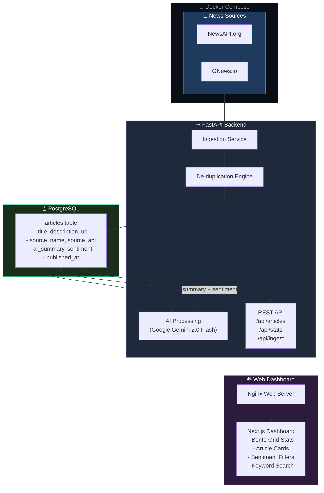
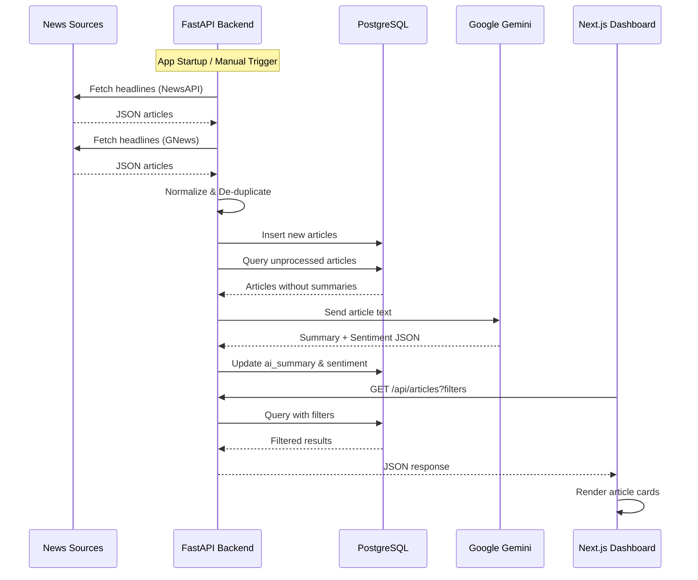
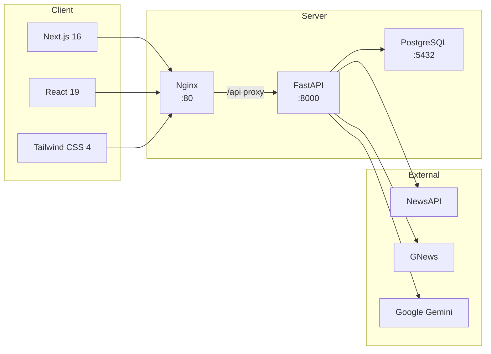

# Architecture Diagram

## System Overview

```mermaid
flowchart TD
    subgraph Sources["📡 News Sources"]
        NA["NewsAPI.org"]
        GN["GNews.io"]
    end

    subgraph Backend["⚙️ FastAPI Backend"]
        ING["Ingestion Service"]
        DD["De-duplication Engine"]
        AI["AI Processing\n(Google Gemini 2.0 Flash)"]
        API["REST API\n/api/articles\n/api/stats\n/api/ingest"]
    end

    subgraph Database["🗄️ PostgreSQL"]
        DB["articles table\n- title, description, url\n- source_name, source_api\n- ai_summary, sentiment\n- published_at"]
    end

    subgraph Frontend["🌐 Web Dashboard"]
        NG["Nginx Web Server"]
        UI["Next.js Dashboard\n- Bento Grid Stats\n- Article Cards\n- Sentiment Filters\n- Keyword Search"]
    end

    subgraph Docker["🐳 Docker Compose"]
        Sources --> ING
        ING --> DD
        DD --> DB
        DB --> AI
        AI -->|summary + sentiment| DB
        DB --> API
        API --> NG
        NG --> UI
    end

    style Sources fill:#1e3a5f,stroke:#3b82f6,color:#fff
    style Backend fill:#1e293b,stroke:#818cf8,color:#fff
    style Database fill:#1a2e1a,stroke:#34d399,color:#fff
    style Frontend fill:#2d1b3d,stroke:#a78bfa,color:#fff
    style Docker fill:#0a0e17,stroke:#334155,color:#94a3b8
```

## Data Flow

```mermaid
sequenceDiagram
    participant S as News Sources
    participant B as FastAPI Backend
    participant DB as PostgreSQL
    participant AI as Google Gemini
    participant F as Next.js Dashboard

    Note over B: App Startup / Manual Trigger
    B->>S: Fetch headlines (NewsAPI)
    S-->>B: JSON articles
    B->>S: Fetch headlines (GNews)
    S-->>B: JSON articles
    B->>B: Normalize & De-duplicate
    B->>DB: Insert new articles
    B->>DB: Query unprocessed articles
    DB-->>B: Articles without summaries
    B->>AI: Send article text
    AI-->>B: Summary + Sentiment JSON
    B->>DB: Update ai_summary & sentiment
    F->>B: GET /api/articles?filters
    B->>DB: Query with filters
    DB-->>B: Filtered results
    B-->>F: JSON response
    F->>F: Render article cards
```

## Technology Stack

```mermaid
graph LR
    subgraph Client
        NX["Next.js 16"]
        RC["React 19"]
        TW["Tailwind CSS 4"]
    end

    subgraph Server
        NGINX["Nginx\n:80"]
        FASTAPI["FastAPI\n:8000"]
        PG["PostgreSQL\n:5432"]
    end

    subgraph External
        NEWSAPI["NewsAPI"]
        GNEWS["GNews"]
        GEMINI["Google Gemini"]
    end

    NX & RC & TW --> NGINX
    NGINX -->|/api proxy| FASTAPI
    FASTAPI --> PG
    FASTAPI --> NEWSAPI
    FASTAPI --> GNEWS
    FASTAPI --> GEMINI
```
